:::{#hero-heading}
This site shows our current EIP staff and describes their roles within the program. You can go to their personal page by clicking on their image, directing you towards their current metrics.
:::

 
 
 

### HPAs

The role of the EIP Health Promotion Advocate (HPA)...

::: {style="display: grid;grid-template-columns: repeat(auto-fill, minmax(150px, 1fr));grid-gap: 1em;" layout-valign="bottom"}
[{group="hpa-gallery"}](p_abbey.html "Pierre Abbey")

[{group="hpa-gallery"}](b_johannes.html "Brooke Johannes")

[{group="hpa-gallery"}](c_may.html "Cameron May")

{group="hpa-gallery" fig-alt="Brooke Pitula"}

[{group="hpa-gallery"}](c_powers.html "Connor Powers")

[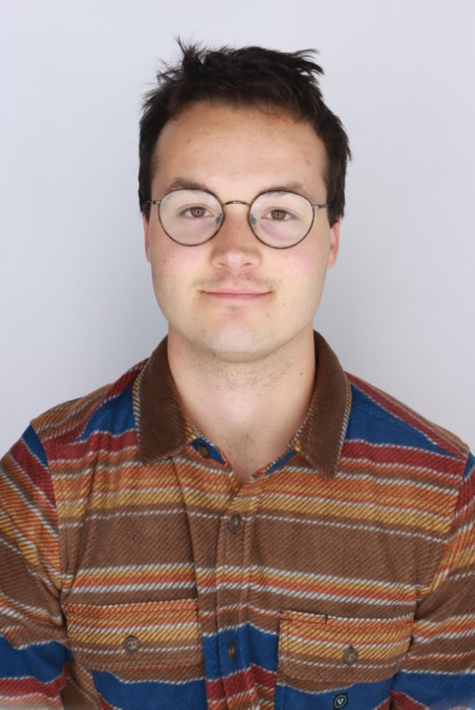{group="hpa-gallery"}](t_spaeth.html "Timothy Spaeth")
:::

 
 
 

### srHPAs

The role of the EIP Senior Health Promotion Advocate (srHPA)...

::: {style="display: grid;grid-template-columns: repeat(auto-fill, minmax(150px, 1fr));grid-gap: 1em;" layout-valign="bottom"}
[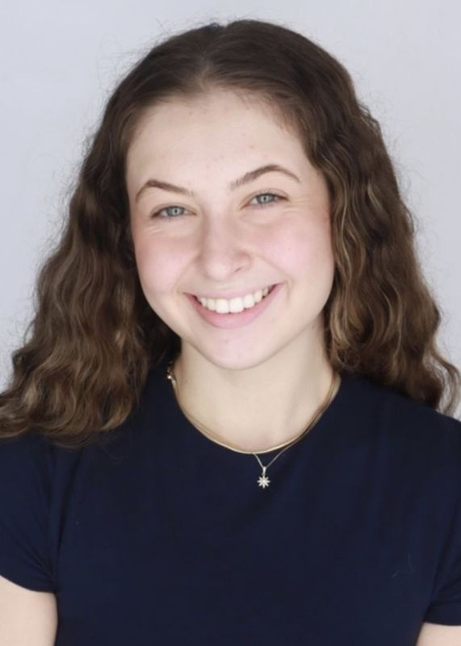{group="srhpa-gallery"}](b_procaccio.html "Bella Procaccio")
:::

 
 
 

### CRAs

The role of the EIP Clinical Research Assistant (CRA)...

::: {style="display: grid;grid-template-columns: repeat(auto-fill, minmax(150px, 1fr));grid-gap: 1em;" layout-valign="bottom"}
[{group="cra-gallery"}](k_anderson.html "Katie Anderson")

[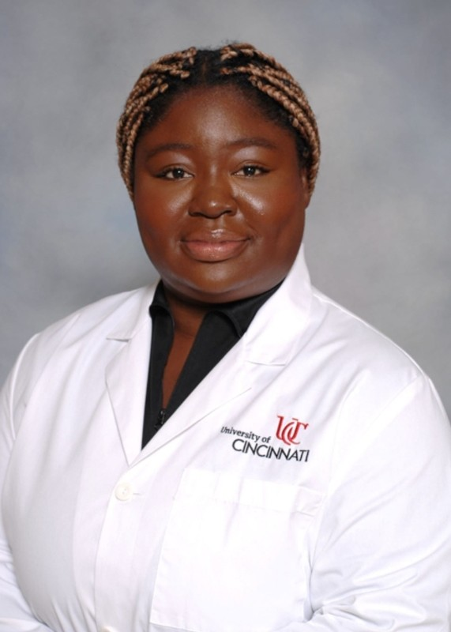{group="cra-gallery"}](n_brempong.html "Neria Brempong")

[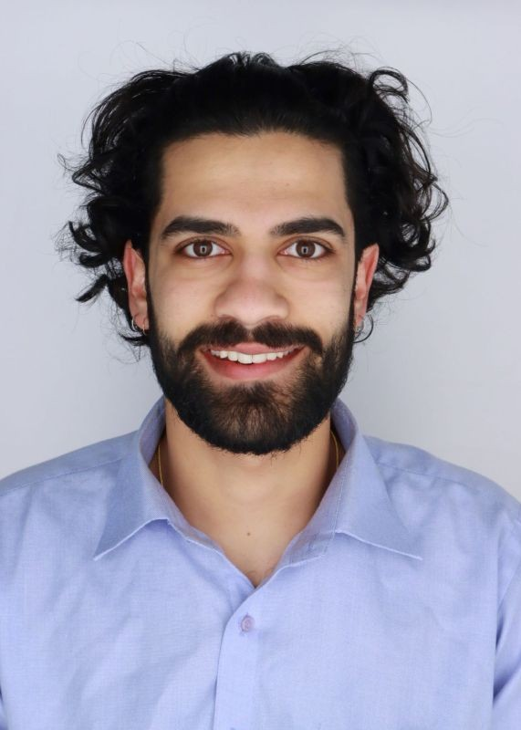{group="cra-gallery"}](a_deshpande.html "Archit Deshpande")

[{group="cra-gallery"}](c_mack.html "Carmen Mack")

[{group="cra-gallery"}](n_mcgorry.html "Noah McGorry")
:::

 
 
 

### CRPs

The role of the EIP Clinical Research Professional (CRP)...

::: {style="display: grid;grid-template-columns: repeat(auto-fill, minmax(150px, 1fr));grid-gap: 1em;" layout-valign="bottom"}
[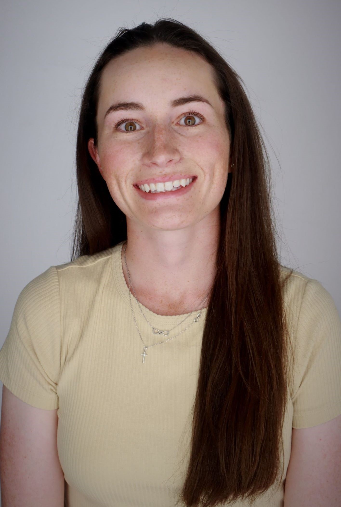{group="crp-gallery"}](k_hallinan.html "Katie Hallinan")

[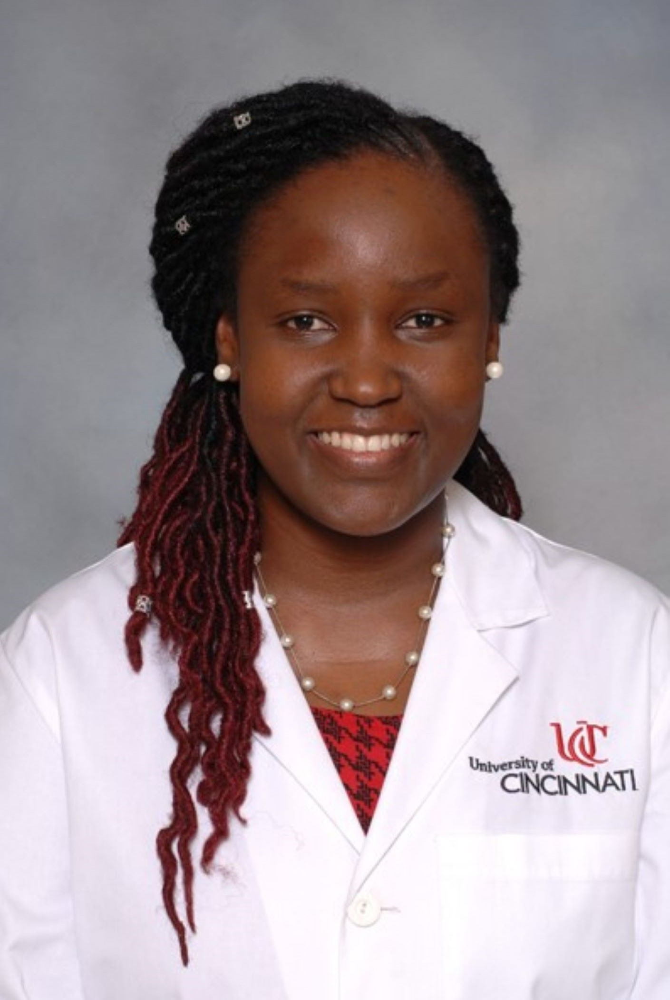{group="crp-gallery"}](r_kombo.html "Rachel Kombo")

[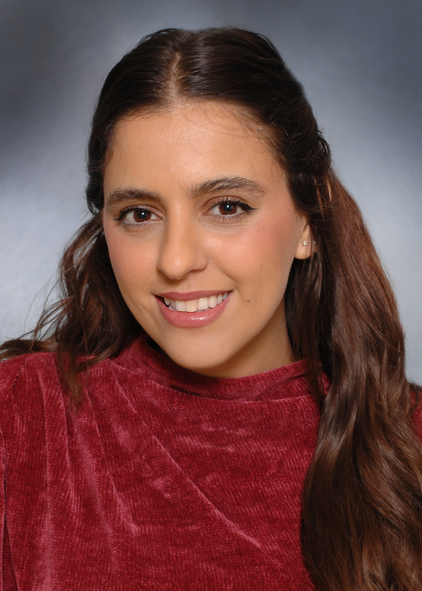{group="crp-gallery"}](a_salameh.html "Alaa Salameh")
:::

 
 
 

### Peers

The role of the EIP Peer Support Staff...

::: {style="display: grid;grid-template-columns: repeat(auto-fill, minmax(150px, 1fr));grid-gap: 1em;" layout-valign="bottom"}
[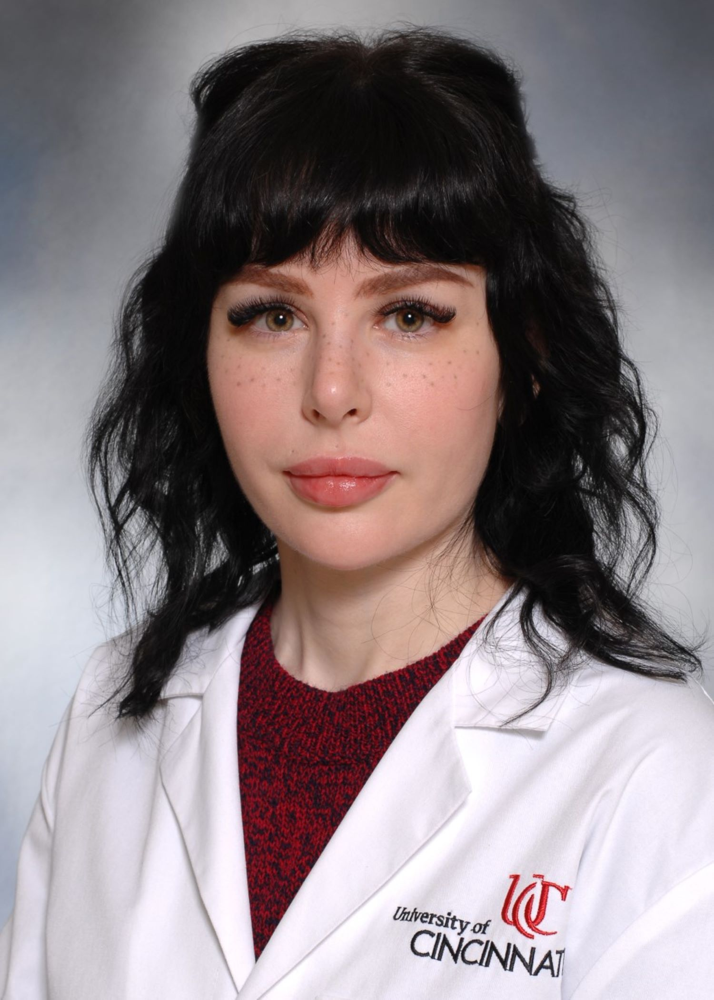{group="peer-gallery"}](l_duba.html "Lauren Duba")

[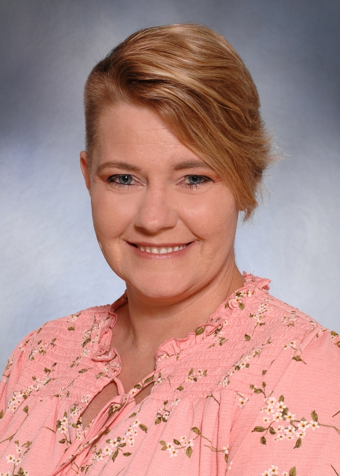{group="peer-gallery"}](k_legg.html "Kathy Legg")

:::

 
 
 

### Operations

The role of the EIP Operations Team...

::: {style="display: grid;grid-template-columns: repeat(auto-fill, minmax(150px, 1fr));grid-gap: 1em;" layout-valign="bottom"}
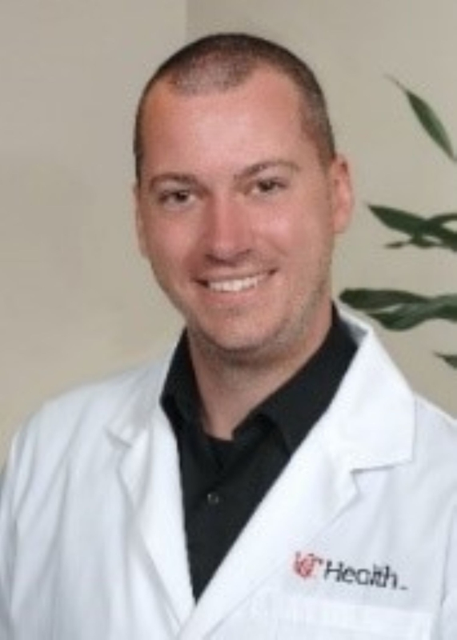{group="ops-gallery" fig-alt="Rob Braun"}

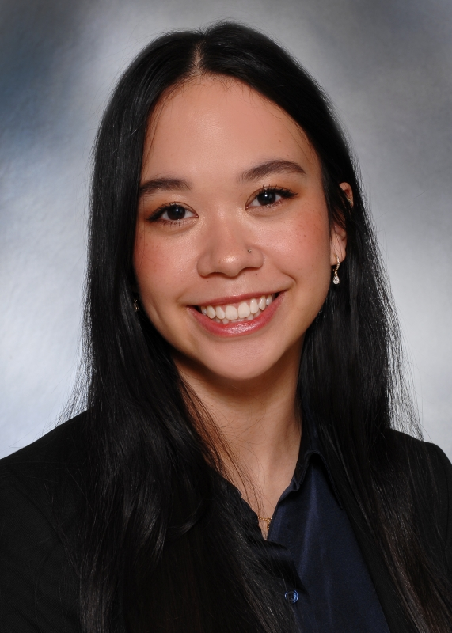{group="ops-gallery" fig-alt="Elysia Smith"}

[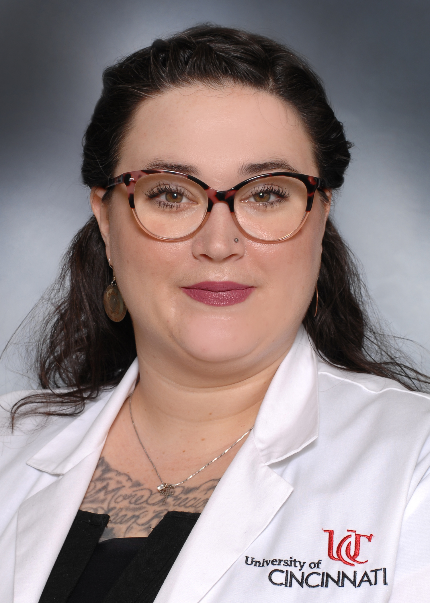{group="ops-gallery"}](c_striker.html "Chloe Striker")
:::

