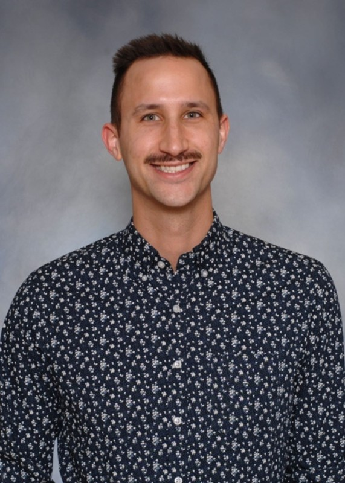
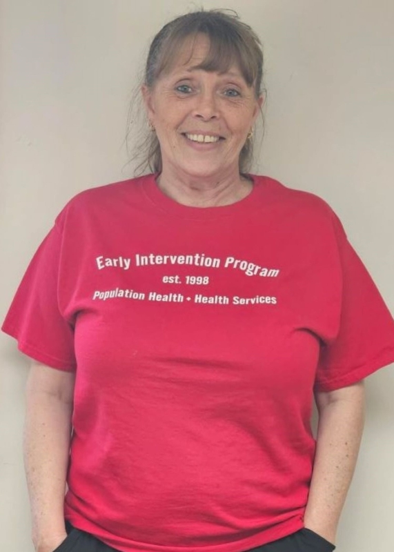
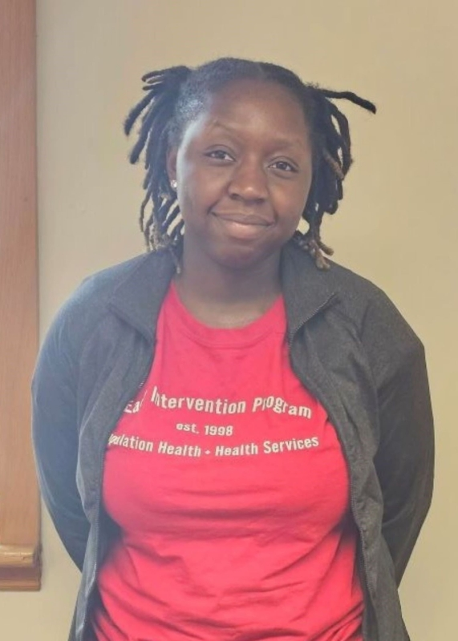
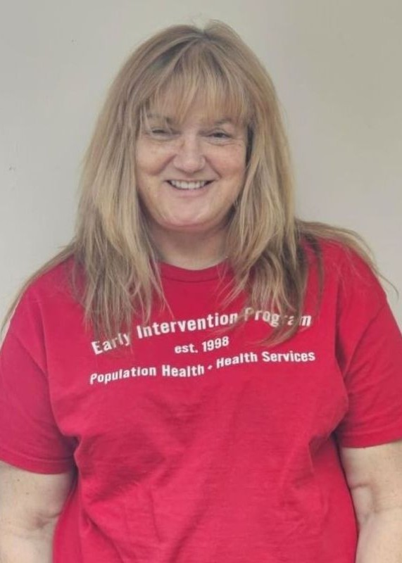

:::{#hero-heading}
This site shows our current EIP staff and describes their roles within the program. You can go to their personal page by clicking on their image, directing you towards their current metrics.
:::

 
 
 

### HPAs

The role of the EIP Health Promotion Advocate (HPA)...

::: {style="display: grid;grid-template-columns: repeat(auto-fill, minmax(150px, 1fr));grid-gap: 1em;" layout-valign="bottom"}
[{group="hpa-gallery"}](p_abbey.html "Pierre Abbey")

[{group="hpa-gallery"}](b_johannes.html "Brooke Johannes")

[{group="hpa-gallery"}](c_may.html "Cameron May")

[{group="hpa-gallery"}](n_sarker.html "Niharika Sarker")

[{group="hpa-gallery"}](t_spaeth.html "Timothy Spaeth")
:::

 
 
 

### srHPAs

The role of the EIP Senior Health Promotion Advocate (srHPA)...

::: {style="display: grid;grid-template-columns: repeat(auto-fill, minmax(150px, 1fr));grid-gap: 1em;" layout-valign="bottom"}
[{group="srhpa-gallery"}](b_procaccio.html "Bella Procaccio")
:::

 
 
 

### CRAs

The role of the EIP Clinical Research Assistant (CRA)...

::: {style="display: grid;grid-template-columns: repeat(auto-fill, minmax(150px, 1fr));grid-gap: 1em;" layout-valign="bottom"}
[{group="cra-gallery"}](k_anderson.html "Katie Anderson")

[{group="cra-gallery"}](r_black.html "Rachael Black")

[{group="cra-gallery"}](n_brempong.html "Neria Brempong")

[{group="cra-gallery"}](a_deshpande.html "Archit Deshpande")

[{group="cra-gallery"}](c_mack.html "Carmen Mack")

[{group="cra-gallery"}](m_mays.html "Meg Mays")

[{group="cra-gallery"}](n_mcgorry.html "Noah McGorry")
:::

 
 
 

### CRPs

The role of the EIP Clinical Research Professional (CRP)...

::: {style="display: grid;grid-template-columns: repeat(auto-fill, minmax(150px, 1fr));grid-gap: 1em;" layout-valign="bottom"}
[{group="crp-gallery"}](j_fiorelli.html "Joseph Fiorelli")

[{group="crp-gallery"}](k_hallinan.html "Katie Hallinan")

[{group="crp-gallery"}](r_kombo.html "Rachel Kombo")

[{group="crp-gallery"}](a_salameh.html "Alaa Salameh")
:::

 
 
 

### Peers

The role of the EIP Peer Support Staff...

::: {style="display: grid;grid-template-columns: repeat(auto-fill, minmax(150px, 1fr));grid-gap: 1em;" layout-valign="bottom"}
{group="peer-gallery" fig-alt="Kimberly Arnold"}

[{group="peer-gallery"}](l_duba.html "Lauren Duba")

{group="peer-gallery" fig-alt="Janelle Freman"}

[{group="peer-gallery"}](k_legg.html "Kathy Legg")

{group="peer-gallery" fig-alt="Dawn Selleny"}
:::

 
 
 

### Operations

The role of the EIP Operations Team...

::: {style="display: grid;grid-template-columns: repeat(auto-fill, minmax(150px, 1fr));grid-gap: 1em;" layout-valign="bottom"}
{group="ops-gallery" fig-alt="Jessika Bass"}

{group="ops-gallery" fig-alt="Rob Braun"}

{group="ops-gallery" fig-alt="Elysia Smith"}

[{group="ops-gallery"}](c_striker.html "Chloe Striker")
:::

